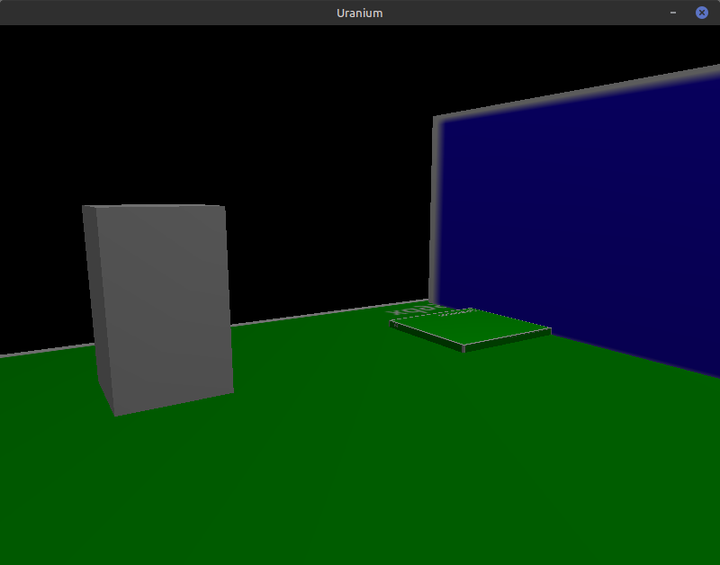
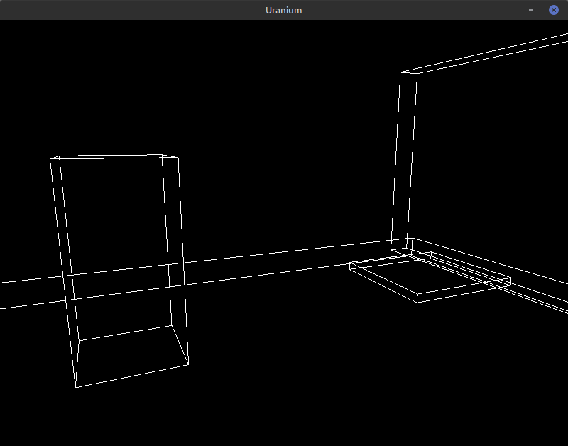

## Uranium
This is an engine written in C using GLFW and OpenGL. The engine is divided into several parts (launcher, game, engine) for ease of working with it. Also, if you find an error or bug, please report it to the [issues](https://github.com/dreadcraftteam/Uranium/issues) section. Currently, compilation is supported only on Linux and only on x64.


Pull requests are welcome!

## How to Build
1. Install [Git](https://git-scm.com/).
2. Clone repository:
```
git clone https://github.com/dreadcraftteam/Uranium.git
```
3. Install this dependencies:
```
libglfw3-dev libglew-dev freeglut3-dev
```
4. Inside the cloned directory, run the compilation by running this file:
```
build.sh
```
5. Navigate to `build`, there will be a compiled build of the engine.
6. Thats All!

## Screenshots


